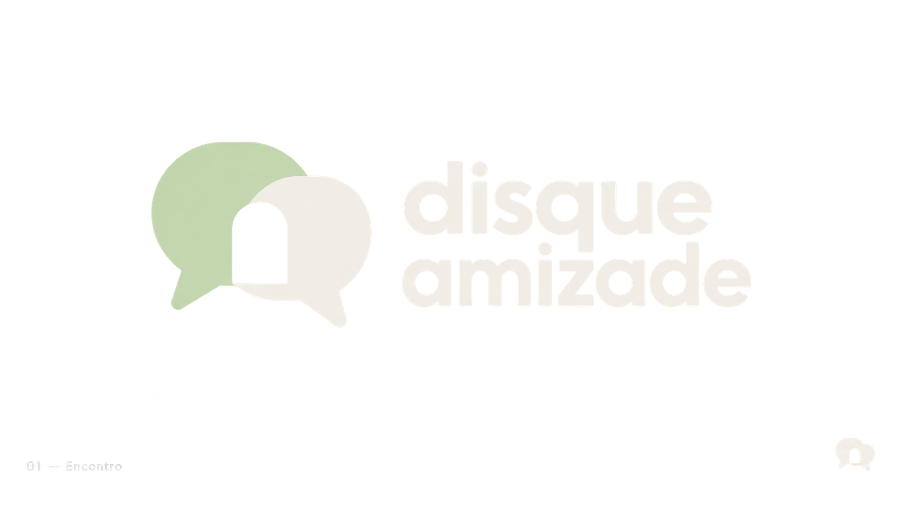
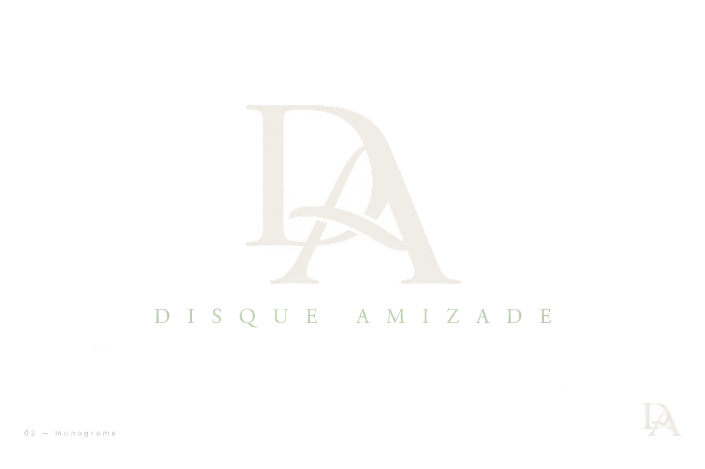
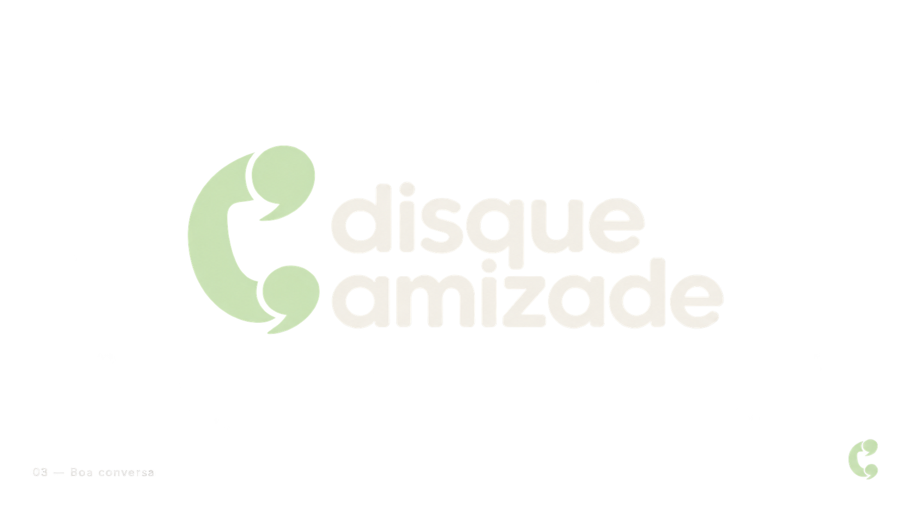
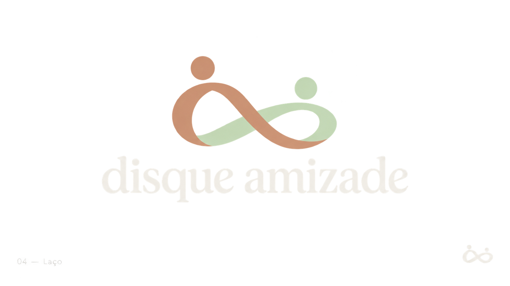
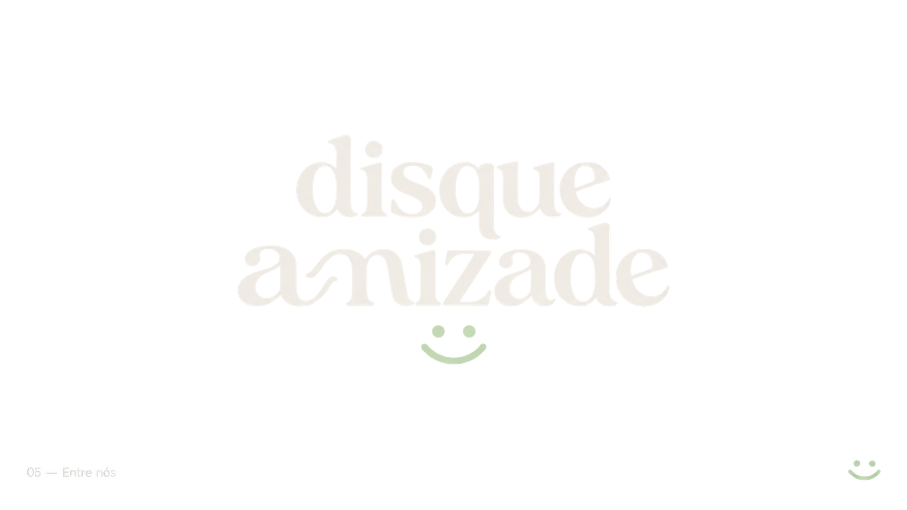

# Opções de logo — Disque Amizade

Cinco estudos visuais gerados com a ferramenta integrada de imagens, para escolha e refinamento. Nenhuma opção foi aplicada ao site. São imagens raster de apresentação; a marca escolhida precisa de acabamento vetorial, ajustes ópticos e versões de uso pequeno.

## 01 — Encontro

Direção do prompt: An abstract distinctive mark made from two interlocking speech shapes, negative space forms a small open doorway between them. Balanced architectural curves, simple chunky shapes, warm and welcoming. Pair with custom lowercase humanist sans wordmark, two lines 'disque' and 'amizade'. Sage symbol, warm ivory wordmark.

## 02 — Monograma

Direção do prompt: A sophisticated DA monogram using an elegant contemporary serif with subtly interwoven D and A, readable not tangled, softly rounded ends, strong silhouette. Pair with restrained wide-tracked small uppercase 'DISQUE AMIZADE'. Warm ivory symbol and sage wordmark. Editorial elegance, not a wedding monogram.

## 03 — Boa conversa

Direção do prompt: A single iconic abstract telephone receiver whose two ends turn into opposing speech commas, one fluid bold silhouette, a clever modern nod to friendship by telephone. Pair with beautifully kerned lowercase rounded sans 'disque amizade'. Sage mark, warm ivory type. Avoid looking like WhatsApp; no enclosing green circle or chat bubble.

## 04 — Laço

Direção do prompt: A refined abstract continuous ribbon knot formed by two rounded loops meeting in the middle, symbolic of two people connecting, asymmetrical enough to feel proprietary, not a generic infinity symbol. Pair with a contemporary warm serif lowercase wordmark 'disque amizade'. Clay symbol, ivory lettering; small sage detail allowed.

## 05 — Entre nós

Direção do prompt: A typography-led logo: bespoke lowercase wordmark 'disque amizade', elegant expressive serif with gently curved terminals and expertly spaced letters, one memorable ligature joining the a and m in amizade like a friendly embrace. Tiny two-dot and curved-line smile as an understated standalone mark below. Ivory wordmark, sage small mark. Confident elegant minimal editorial brand.

## Direção comum dos prompts

Premium original logo for the Brazilian friendship and live conversation website Disque Amizade. Dark graphite #151916 background; sage #c5dbb4, ivory #f1eee6, clay #c8987b. Wide horizontal presentation, generous negative space, centered logo, concept label bottom left and small standalone favicon bottom right. Clear wordmark, flat vector-like artwork, no mockups, slogans, textures, shadows or 3D. These are explorations; generated effects may differ from the requested flat finish.
