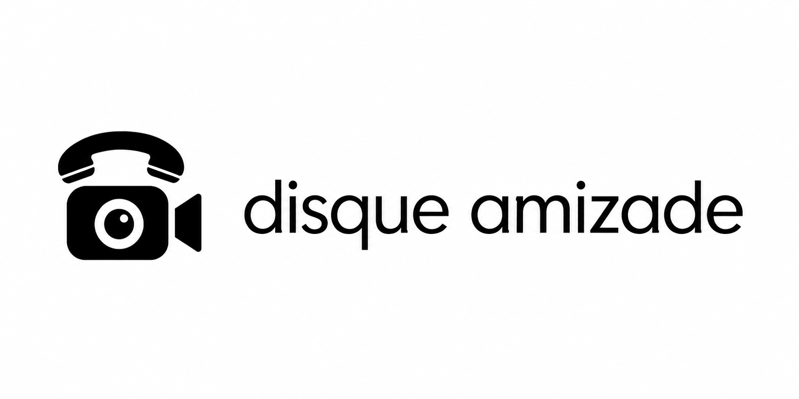

# Marca selecionada: fone + câmera

O usuário escolheu a opção 1 do estudo que combina telefone antigo e videochat.

Estudo raster da composição horizontal, produzido com a ferramenta integrada de geração de imagens. Preserva o fone antigo acima da câmera e posiciona o nome à direita, em uma linha.

## Aplicação no site

O símbolo foi reconstruído em SVG para uso nítido em tamanhos pequenos. O componente compartilhado `BrandLogo` combina o símbolo sálvia com o nome em branco quente, na fonte do site.

- `public/brand/mark.svg`: símbolo transparente.
- `public/brand/logo-horizontal.svg`: composição horizontal independente.
- `src/components/common/BrandLogo.tsx`: marca responsiva no cabeçalho, rodapé, conta e câmera; símbolo compacto na sala.
- `public/favicon.svg`, `public/apple-touch-icon.png` e `public/brand/icon-*.png`: navegador e atalhos.
- `public/og-image.svg` e `public/og-image.png`: imagem compartilhada por links.

Verificado em navegador nas larguras 1440, 390 e 320, sem transbordamento ou imagens da marca quebradas. Build e 38 testes existentes aprovados.

Direção do prompt: faithfully adapt only the leftmost reference logo into a horizontal lockup. Vintage curved handset above rounded video camera body, circular lens with small highlight, triangular video protrusion. Symbol left, exact lowercase wordmark “disque amizade” right on one line, geometric rounded sans. Solid black artwork on opaque white background, clean contours, balanced spacing, no effects or extra text.
